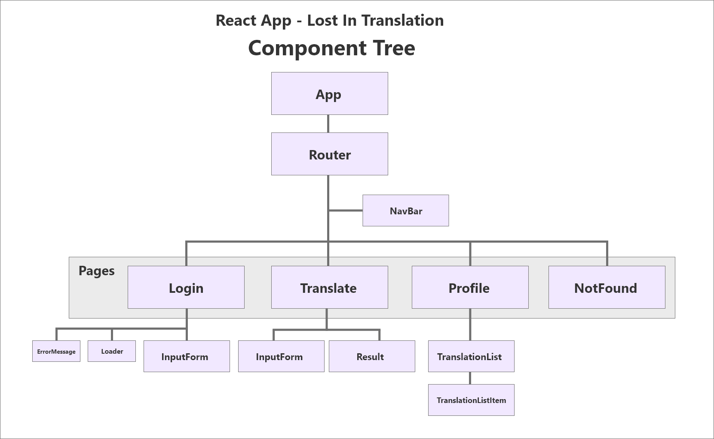
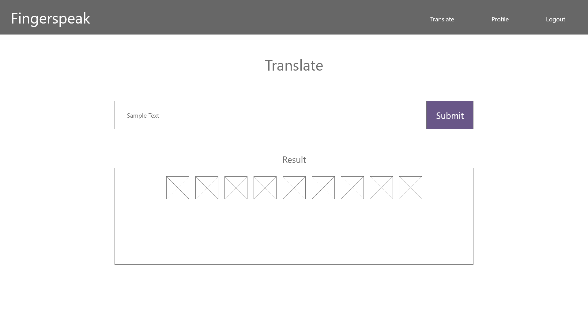
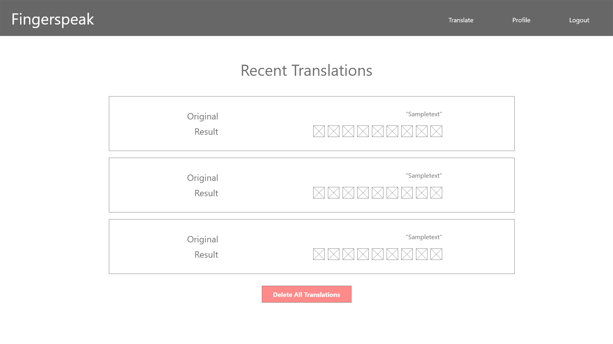
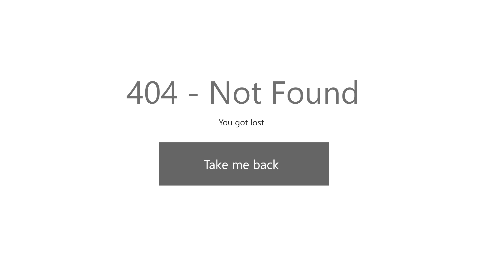

# Noroff Front-End Assignment 3 - React
## Lost In Translation

An app that takes your words and turns them into hands.

# Development Team & Deliveries:

Repository on [Gitlab](https://seventhdisaster.gitlab.io/assignment-1-js-komputer/) (https://seventhdisaster.gitlab.io/assignment-1-js-komputer/)

## Krister Emanuelsen:

Front-End Release: [FingerSpeak (https://seventh-noroff-react-lit.herokuapp.com)](https://seventh-noroff-react-lit.herokuapp.com)

API Release: [https://seventh-noroff-task-api.herokuapp.com/translations](https://seventh-noroff-task-api.herokuapp.com/translations)

## Alexander Maaby:  

Front-End Release: [FingerSpeak (https://aqueous-shore-61145.herokuapp.com/)](https://aqueous-shore-61145.herokuapp.com/)

API Release: [https://noroff-flammekastar-api.herokuapp.com/translations](https://noroff-flammekastar-api.herokuapp.com/translations)

# Setup

Local development setup of the app can be done by cloning the repository and running the following:

- `npm install` - to install required packages (required node / npm)
- `npm start` - to start the dev server
- (other): `npm build` - builds a production build of the app

The project was initialized with typescript using `npx create-react-app --template typescript`

> **Note:** `IMPORTANT!`  
In order to make calls to your own instance of the API, you need to change the URL and API-KEY found in:   `/src/api/userAPI.ts`
  
We would normally ***never*** store keys outside of environment variables and exposed in the files, but for the sake of this assignment, this is how we do it. 
Our endpoints and back-ends will be taken offline before these repositories are made public. 

# Known Bugs and Errors:
- On the translation page

# Design

Prior to development we created a component tree to plan out the structure of the app, along with wireframes to help guide the design during development. 

Below Illustrations created with Adobe XD:
> **Note:** Current look of the app may differ from the the wireframe representations.

## You found Dewaldo

# 
